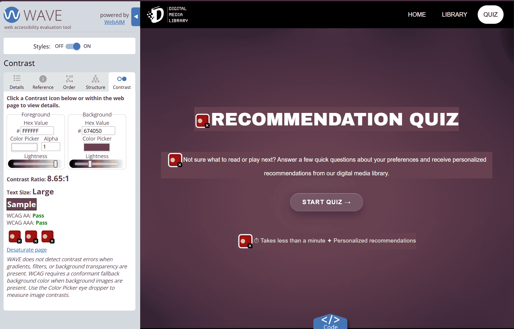

# Digital Media Library

Digital Media Library ist ein persönlicher Webauftritt in Form einer digitalen Mediathek.  
Die Website präsentiert eine Auswahl meiner Lieblingsbücher und Lieblingsvideospiele in einem bibliotheksinspirierten Interface mit persönlichen Bewertungen, Kommentaren und Empfehlungen.

Die Website wird vollständig englischsprachig umgesetzt.

---

## Inhaltsverzeichnis 
- [Seitenübersicht](#seitenübersicht)
- [Technologien](#technologien)
- [Git Workflow](#git-workflow)
- [Besondere Funktionen](#besondere-funktionen)
- [Größere Änderungen](#größere-änderungen-während-der-entwicklung)
- [Responsives Design](#responsives-design)
- [Accessibility](#accessibility)
- [Performance](#performance)
- [Persönliche Herausforderungen](#persönliche-herausforderungen)

---

## Seitenübersicht

- **Home** – Persönliche „Library Card“ als Einstieg in die Website
- **Library** – Gemeinsame Bibliothek für Bücher und Videospiele
- **Quiz** – Interaktives Recommendation Quiz
- **Imprint** – Rechtliche Informationen
- **Credits** – Quellenangaben für Medien, Cover und weitere verwendete Inhalte
- **404** – Individuell gestaltete Fehlerseite

---

## Technologien 
### Techstack

- HTML5 
- CSS3 
- JavaScript 

### Verwendete Libraries
#### [GSAP (GreenSock Animation Platform)](https://gsap.com/)

- Animierter Filter- und Toggle-Indikator
- Dezente Übergangsanimationen beim Filterwechsel

#### [HTMX](https://htmx.org/)

- Wiederverwendbare Header- und Footer-Komponenten 

---

## Git Workflow

Die Entwicklung erfolgte auf einem separaten `development`-Branch. Neue Funktionen und Änderungen wurden dort schrittweise mit [Conventional Commits](https://www.conventionalcommits.org/en/v1.0.0/) (z. B. `feat:`, `fix:`, `style:`, `docs:`, `refactor:`) dokumentiert.

Sobald ein funktionsfähiger Zwischenstand erreicht war, wurden die Änderungen in den `main`-Branch zusammengeführt. Dadurch enthielt der `main`-Branch ausschließlich lauffähige Projektstände, während die eigentliche Entwicklung im `development`-Branch stattfand.

--- 

## Besondere Funktionen

Die folgenden Funktionen wurden zusätzlich zu den grundlegenden Projektanforderungen umgesetzt und stellen die wesentlichen Eigenleistungen dieses Projekts dar.

### Individuelle UI-Komponenten

- Eigenständig gestaltetes Logo und SVG-Favicon sowie Chibi-Illustration der Library Card
- Responsive Library Card 
- Dynamisches Detail-Ticket 
- Wiederverwendbare Glassmorphism-Komponenten (`glass-button`, `glass-toggle`)

### Interaktive Library

- Horizontales Shelf mit Scroll-Snapping
- Semantisch aufgebaute Medienliste (`<ul>` / `<li>`) mit interaktiven Listenelementen und ergänzenden ARIA-Rollen
- Drag-to-Scroll auf Desktop-Geräten (Maussteuerung)
- Tastatursteuerung der Shelf-Items (Pfeiltasten/Enter)
- Aktive Hervorhebung des ausgewählten Shelf-Items
- Automatische Zentrierung des ausgewählten Shelf-Items
- Responsive Filtersystem mit „All“-Filter und einklappbarem Filter-Menü auf mobilen Geräten

### Dynamische Detailansicht

- Rendering erst nach Auswahl eines Mediums 
- Scrollbare Kommentare 
- Smooth Scroll auf größeren Geräten 
- "More Details"-Navigation auf Smartphones

### Recommendation Quiz

- Genrebasiertes Empfehlungssystem 
- Unterschiedliche Abläufe für Bücher und Spiele 
- Dynamisch erzeugte Fragen 
- Fortschrittsanzeige & Zurück-Navigation für bessere Usability
- Dynamisch generierte Ergebnisseite

### Deep Linking

Die Library unterstützt Deep Links über URL-Parameter. Beispiel: `library.html?type=books&media=no-longer-human`

Beim Aufruf einer solchen URL wird das entsprechende Medium automatisch ausgewählt und direkt in der Detailansicht geöffnet. Die Ergebnislinks des Recommendation Quiz nutzen diese Funktion, indem sie Medientyp und Medien-ID als URL-Parameter übergeben und so direkt zur empfohlenen Detailansicht navigieren.

---

## Größere Änderungen während der Entwicklung
### Refactoring der Medienverwaltung

Die ursprüngliche Umsetzung bestand aus zwei nahezu identischen Dateien (`books.js` und `games.js`) mit doppelter Daten- und Shelf-Logik.

Im Verlauf der Entwicklung wurde die Struktur vollständig überarbeitet:
- Alle Mediendaten wurden in einer gemeinsamen `data.js` zentralisiert.
- Die doppelte Shelf-Logik wurde in eine wiederverwendbare `mediaShelf.js` ausgelagert.
- Dadurch verwenden Books und Games dieselbe JavaScript-Komponente und unterscheiden sich nur noch durch ihre Datenbasis.

Dieses Refactoring reduzierte redundanten Code erheblich und verbesserte die Wartbarkeit sowie die Erweiterbarkeit der Anwendung.

### Zusammenführung der Medienseiten

Zu Beginn der Entwicklung existierten für Bücher und Videospiele zwei separate Seiten (`books.html` und `games.html`), deren HTML-Struktur und JavaScript-Logik sich größtenteils ähnelten.

Im Rahmen eines Refactorings wurden beide Seiten zu einer gemeinsamen `library.html` zusammengeführt. Dadurch befindet sich die Navigation zwischen Büchern und Videospielen nicht mehr auf unterschiedlichen Seiten, sondern erfolgt über einen Toggle im Hero-Bereich der Library. 

Dabei wurden:

- Hero-Bereich, Filter und Shelf abhängig vom ausgewählten Medientyp dynamisch angepasst
- die vorhandene Datenbasis weiterverwendet
- die gemeinsame `mediaShelf.js` für beide Medientypen eingesetzt
- Deep Links über URL-Parameter beibehalten
- Bücher und Videospiele über einen Toggle auswählbar gemacht

Durch die Zusammenführung konnte redundanter HTML- und JavaScript-Code reduziert, die Wartbarkeit verbessert und gleichzeitig die Benutzerführung vereinfacht werden.

### Refactoring des Recommendation Quiz

Die ursprüngliche Quiz-Logik verwendete zwei getrennte Funktionen für Bücher und Spiele (`showBookQuestions()` und `showGameQuestions()`), obwohl sich deren Ablauf weitgehend ähnelte.

Im Rahmen eines Refactorings wurden die Fragen in getrennten Datenstrukturen (`bookQuestions` und `gameQuestions`) organisiert und die doppelte Logik in einer gemeinsamen Funktion `showQuestions()` zusammengeführt.

Abhängig vom gewählten Medientyp verarbeitet dieselbe Funktion nun den jeweils passenden Fragensatz. Dadurch wurde redundanter JavaScript-Code reduziert und die Quiz-Logik übersichtlicher, wartbarer und leichter erweiterbar gestaltet.

### CSS-Refactoring

Während der Entwicklung wurde das Stylesheet vollständig neu strukturiert. Dabei wurden unter anderem umgesetzt:

- Einführung von nativem CSS Nesting zur besseren Strukturierung zusammengehöriger Selektoren
- Vereinheitlichung der Abschnittsstruktur und Kommentierung
- Einsatz wiederverwendbarer CSS-Komponenten und Design Tokens für eine konsistente Gestaltung
- Reduzierung redundanter Selektoren und Verbesserung der Wartbarkeit

---

## Responsives Design

Die Website wurde entsprechend der Projektanforderung für Bildschirmbreiten von **360 px bis 1920 px** entwickelt. Zum Einsatz kamen unter anderem:

- CSS Grid
- Flexbox
- CSS Custom Properties (Design Tokens)
- `clamp()` für flüssig skalierende Größen und Typografie
- Mehrere Media Queries

Während der Entwicklung wurden Layout und Bedienbarkeit zunächst mithilfe der **Browser Developer Tools** im **Responsive Design Mode** für verschiedene Bildschirmgrößen überprüft. Anschließend erfolgten Tests auf realen Geräten sowie in unterschiedlichen Browsern, um die responsive Darstellung und Funktionalität unter praxisnahen Bedingungen zu validieren.

Getestet wurde unter anderem auf: Desktop-PC, Laptop, iPhone & iPad
sowie in den Browsern: Opera GX & Microsoft Edge

---

## Accessibility

Bei der Entwicklung wurde besonderer Wert auf eine möglichst barrierefreie Bedienung gelegt. Umgesetzt wurden unter anderem:

- semantische HTML5-Elemente
- Tastatursteuerung der Shelf-Items
- Tastatursteuerung des Recommendation Quiz
- sichtbare Fokuszustände
- Einsatz von ARIA-Attributen (`aria-label`, `aria-current`, `aria-expanded`, `aria-live`) zur Unterstützung interaktiver und dynamisch erzeugter Inhalte

Zur Überprüfung der Barrierefreiheit wurden folgende Werkzeuge verwendet:

- WAVE Web Accessibility Evaluation Tool
- Lighthouse Accessibility Audit
- Praxistest mit VoiceOver (iOS) zur Überprüfung der Screenreader-Unterstützung dynamischer Inhalte (z. B. Ankündigung neuer Quizfragen über `aria-live`) – [Demonstrationsvideo](docs/voiceoverquiz-demo.mp4)

> **Hinweis:** Da WAVE den durch CSS erzeugten Blur-Hintergrund der Quizseite nicht vollständig berücksichtigt, wird dort ein Kontrast-Hinweis ausgegeben. Zur Verifizierung wurde der tatsächlich dargestellte Hintergrund mit einem Color Picker geprüft. Die ermittelten Farbwerte erfüllen die erforderlichen Kontrastanforderungen. 

---
## Performance
### Bildoptimierung

Zur Verbesserung der Ladezeiten wurden sämtliche verwendeten Bilder hinsichtlich Dateigröße und Bildformat optimiert.

Für die Buch- und Spielecover wurden die Originalbilder
- auf eine einheitliche Auflösung von 560 × 840 Pixel skaliert, 
- in das moderne Bildformat AVIF konvertiert und 
- mit einer Qualitätsstufe von 50 % exportiert. 

Dadurch konnten die Dateigrößen je nach Bild auf etwa 5–88 KB reduziert werden, ohne sichtbare Qualitätseinbußen. Dies verbessert sowohl die Ladegeschwindigkeit als auch die Performance der Website.

Für andere Bilder wurden jeweils geeignete Formate gewählt:
- Das Hero-Bild der Start- und Quizseite wurde als WebP eingebunden, um eine möglichst gute Balance zwischen Dateigröße und Bildqualität zu erreichen. 
- Icons wurden als PNG verwendet. 
- Logo und Favicon liegen als SVG vor und können dadurch verlustfrei skaliert werden. 

---

## Persönliche Herausforderungen

Eine der größten Herausforderungen war die Umsetzung einer möglichst semantischen HTML-Struktur, ohne dabei das responsive Layout und das Design zu beeinträchtigen. Für die Angaben auf der Library Card wurde zunächst eine Definition List (`<dl>`, `<dt>`, `<dd>`) getestet. Die geänderte HTML-Struktur hätte jedoch umfangreiche Anpassungen des bestehenden CSS und des responsiven Kartenlayouts erfordert, ohne einen wesentlichen semantischen Mehrwert zu bieten. Daher wurde die bestehende Struktur beibehalten.

Auch das visuelle Design stellte eine Herausforderung dar. Da Buch- und Spielecover sehr unterschiedliche Gestaltungsstile besitzen, war es nicht einfach, eine einheitliche Designsprache für die gesamte Website zu entwickeln. Gelöst wurde dies durch eine dynamische Detailansicht: Der Hintergrund übernimmt das jeweilige Coverbild mit einem Weichzeichnereffekt, während das Detail-Ticket für jedes Medium eine eigene Akzentfarbe erhält. Dadurch wirkt die Gestaltung konsistent und passt sich dennoch jedem Medium individuell an.

Eine weitere Herausforderung war die Gestaltung des Detail-Tickets. Ursprünglich waren zusätzliche Elemente wie eine Perforationslinie und ausgestanzte Ticketkanten geplant. Diese führten jedoch insbesondere im responsiven Layout zu Darstellungsproblemen. Auch ein Lösungsversuch mit SVG-Masken brachte neue Einschränkungen mit sich. Aus Gründen der Stabilität und Wartbarkeit wurde deshalb bewusst auf diese Gestaltungselemente verzichtet.